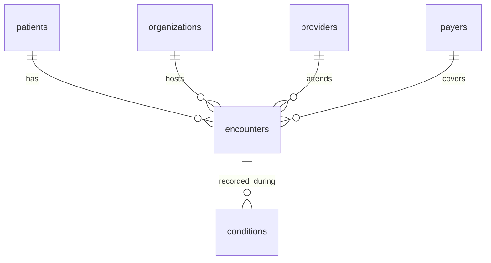

# Day 14 — Write the Documentation

🎯 **Goal:** documentation good enough that a stranger could clone your repo and run the pipeline without asking you anything.

## What you'll learn
- What separates a project from a portfolio project: the write-up
- Drawing an entity-relationship diagram (ERD)

## Your tasks

**1. The README.** Structure it like this:
```
# Project name + one-sentence description
## Architecture        <- a diagram (see task 3)
## Setup               <- the exact commands, in order, from git clone to schema created
## Running the pipeline<- full load, weekly batch, dirty batch — with the commands
## What every run produces  <- log, report, quarantine, etl_run_log
## Repository layout   <- short tree with one-line explanations
## Out of scope        <- the 12 excluded files and WHY (from Day 2)
```
Test it the honest way: follow your own README from the top in a fresh terminal. Every command that fails or confuses you = fix the README.

**2. Pipeline documentation** (`docs/pipeline.md`): one section per stage (extract → validate → transform → load), what each does and the key decisions — read-as-text, all reasons recorded, quarantine not delete, upsert vs skip. A small table of your validation rules with example rejection reasons is perfect.

**3. Draw the star schema.** In markdown you can use mermaid — GitHub renders it:
````

````
Add it to `docs/schema.md` along with a table-by-table description (column, type, meaning).

**4. Hygiene sweep.** Before anyone sees this repo:
```bash
git log --all --oneline          # any commit called "asdf"? squash-worthy?
git grep -i password             # your real password must NOT appear
cat .gitignore                   # .env, logs/, data/incoming/, data/rejected/ all there?
```

**5. Commit everything.** This is the version your reviewers will read.

## ✅ You're done when
- [ ] A fresh-terminal walkthrough of the README works start to finish
- [ ] Pipeline doc + schema doc with ERD exist
- [ ] No secrets anywhere in the repo or its history
- [ ] Committed

## 💡 Tip
Write for the reader who knows nothing about your project — because in six months, that reader is you.
